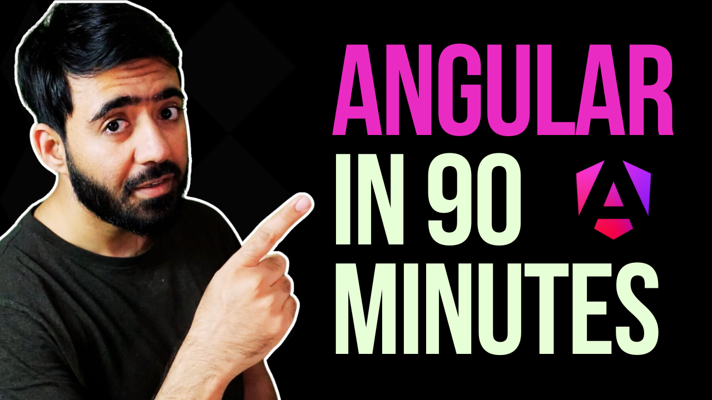

## Angular in 90-ish minutes

Ever wanted to learn Angular quickly? Well, this repository should help. This repository is created alongside the following video tutorial to teach the most important (& core) concepts of Angular:

The repository contains both the slides shown in the video, and the application we built during the video as well.

## Watching the slides

The slides are deployed [here](https://ahsanayaz.github.io/angular-in-90ish/).

## Running the slides locally
- Clone this repository
- `npm install`
- `npm run dev`

## Running the app

To run the app we built in the video tutorial (the final state):
- Clone this repository if you haven't
- `cd first-ng-app`
- `npm install`
- `npm start`
- Navigate to [localhost:4200](http://localhost:4200)